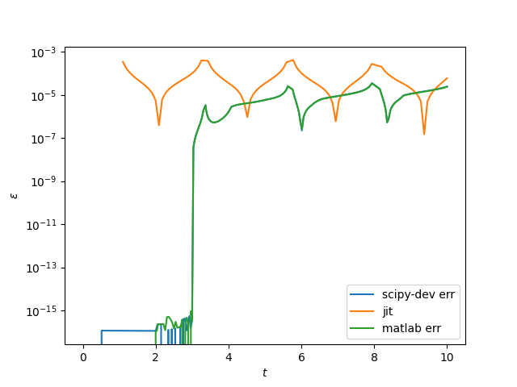
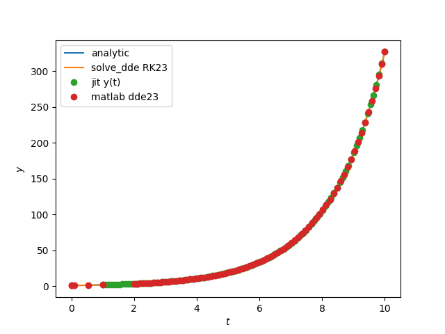
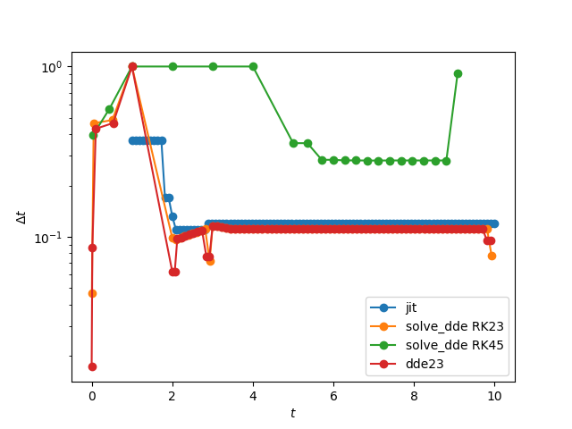
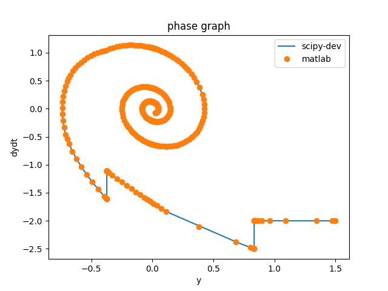
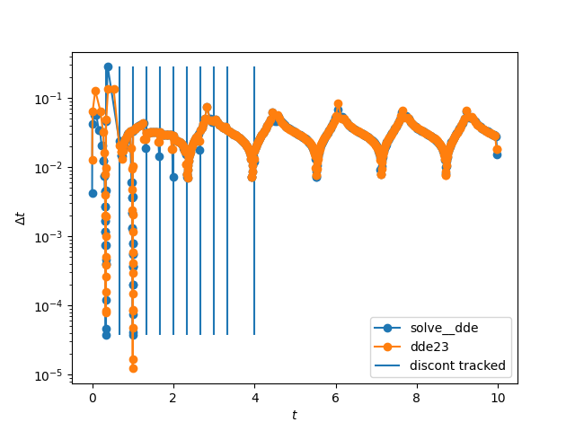
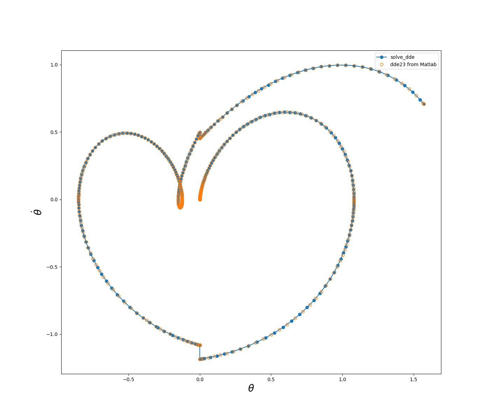
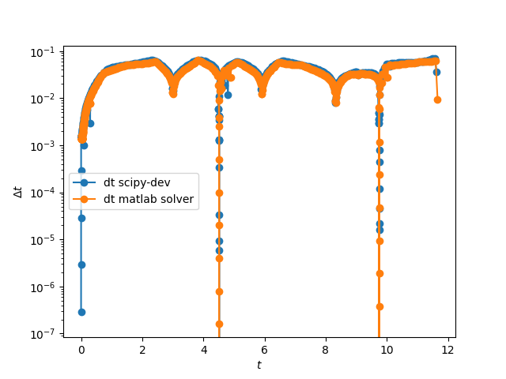
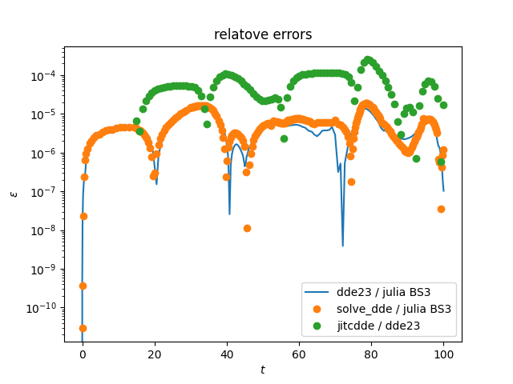
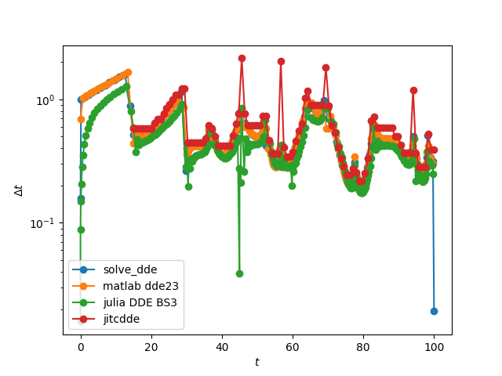

DDE Solver : ***solve_dde***
=====


A development of constant delay differential equations solver in SciPy 
from a fork of version '1.5.0.dev0+912c54c' within the branch *ddeSolver*.

The structure of the solver *solve_dde* is derived from that of *solve_ivp* from scipy/integrate._ivp. 
You will find the folder scipy/integrate/_dde where all the changes have been made. 
The function in named ***solve_dde*** in *scipy/integrate/_dde/dde.py*

## Numerical methods
*solve_dde* use the method of steps with embedded Runge-Kutta RK23 or RK45 integration.
Evaluation of delay terms is realized with continuous extension (or denseOutput) of RK integrator.
Discontinuities tracking is made with location of discontinuities at initialization
of the solver (as solver_dde handles only constant lags) and secondary stepsize controls
are added by modification of the time step when integration is close to a discontinuity.
Only discontinuities of orders lower than the integration scheme order (4) are taken into account. 
If a discontinuity of order 0 is detected by the solver at the initialization, then we add
 one more tracking stage (5), as in the suitecase example.
Location of events is available as in solve_ivp. And restart from previous 
computation feature has been implemented.

## Requirement 
See 
```console
requirements.txt
```
## Sources
The sources used in this work are: 
1. L.F. Shampine, S. Thompson, 2000, Solving DDEs in MATLAB
2. L.F. Shampine, S. Thompson, 2000, Solving Delay Differential Equations with dde23.pdf
3. Oberlet 1981 Numerical Treatment of Delay Differential Equations by Hermite Interpolation
4. L.F. Shampine, S. Thompson, Chapter, 2009, Numerical Solution of Delay Differential Equations

Sources relevant to DDEs:
1. Bellen 2002 Numerical methods for delay differential equations
2. S. Thompson, L.F. Shampine, 2004, A Friendly Fortran DDE Solver

In Oberlet 1981 and Shampine, there are lots of numerical examples used in benchmarks.

Links :\
https://www.radford.edu/~thompson/webddes/index.html\
https://www.radford.edu/~thompson/webddes/ddeevtwhite.html

## Benchmarks
All presented benchmarks are in the folder *DDEs_models_test/*
### converging problem

y'(t) = -y(t-1)

y(t)=y_0 for t<= t_0

script is in DDEs_models_test/convergingDDE.py





### converging problem, influence on numbers of tracking discontinuities stages

script are in DDEs_models_test/convergingDDE_trackingRK23.py and DDEs_models_test/convergingDDE_trackingRK45.py


### diverging problem, or so-called quadrature problem
same as converging problem but with +

y'(t) = y(t-1) \
y(t<=t0)=y_0


script is in DDEs_models_test/divergingDDE.py





### diverging problem with discontinuities in history
same as converging problem but with +

y'(t) = y(t-1) \
y(t<=t0)= (-1)^(floor(-5t))

script is in DDEs_models_test/divergingJumpsDDE.py


### 2 delays 

y'(t) = -y(t-1/3) - y(t-3/2)\
y(t<=t0)=y_0 \

script is in DDEs_models_test/2delays.py


### 2 delays  + init discontinuity

y'(t) = -y(t-1/3) - y(t-3/2)\
y(t0) = y0 \
y(t<t0)=h \

script is in DDEs_models_test/2delays_discont.py






### rocking suitcase model

script is in DDEs_models_test/suitcase.py





### Kermack-McKendrick an infectious disease model


script is in DDEs_models_test/KermackMcKendrick.py


### Mackey-Glass

script is in DDEs_models_test/mackeyGlass.py





