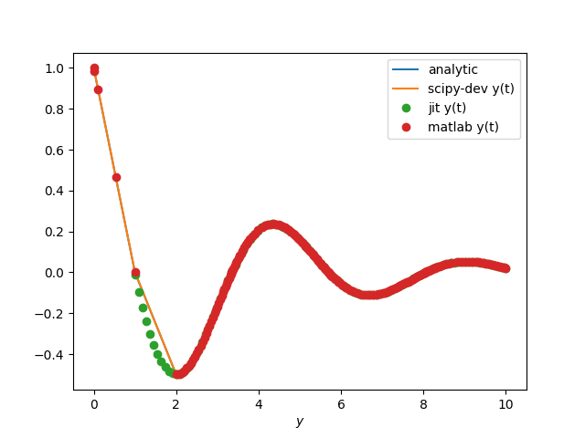
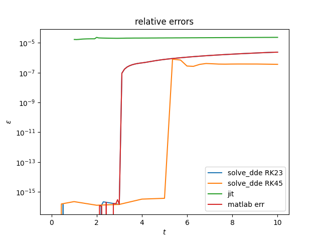
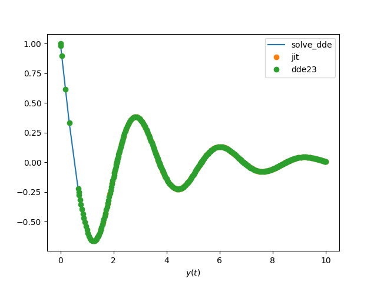
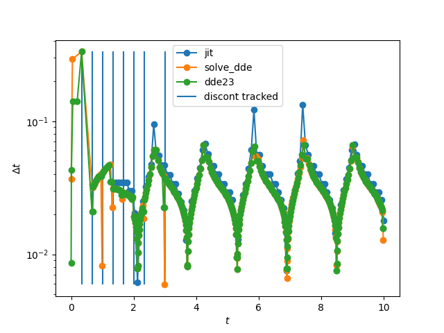
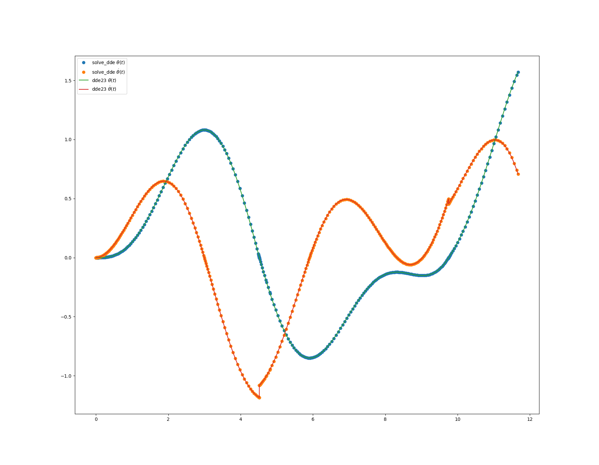
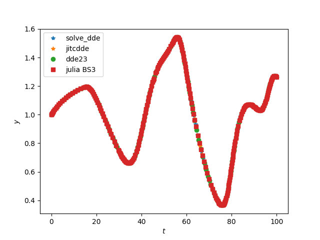

DDE Solver : ***solve_dde***
=====


A development of constant delay differential equations solver in SciPy 
from a fork of version '1.5.0.dev0+912c54c' within the branch *ddeSolver*.

The structure of the solver *solve_dde* is derived from that of *solve_ivp* from scipy/integrate._ivp. 
You will find the folder scipy/integrate/_dde where all the changes have been made. 
The function in named ***solve_dde*** in *scipy/integrate/_dde/dde.py*

## Numerical methods
*solve_dde* use the method of steps with embedded Runge-Kutta RK23 or RK45 integration.
Evaluation of delay terms is realized with continuous extension (or denseOutput) of RK integrator.
Discontinuities tracking is made with location of discontinuities at initialization
of the solver (as solver_dde handles only constant lags) and secondary stepsize controls
are added by modification of the time step when integration is close to a discontinuity.
Only discontinuities of orders lower than the integration scheme order (4) are taken into account. 
If a discontinuity of order 0 is detected by the solver at the initialization, then we add
 one more tracking stage (5), as in the suitecase example.
Location of events is available as in solve_ivp. And restart from previous 
computation feature has been implemented.

## Requirement 
See 
```console
requirements.txt
```
## Sources
The sources used in this work are: 
1. L.F. Shampine, S. Thompson, 2000, Solving DDEs in MATLAB
2. L.F. Shampine, S. Thompson, 2000, Solving Delay Differential Equations with dde23.pdf
3. Oberlet 1981 Numerical Treatment of Delay Differential Equations by Hermite Interpolation
4. L.F. Shampine, S. Thompson, Chapter, 2009, Numerical Solution of Delay Differential Equations

Sources relevant to DDEs:
1. Bellen 2002 Numerical methods for delay differential equations
2. S. Thompson, L.F. Shampine, 2004, A Friendly Fortran DDE Solver

In Oberlet 1981 and Shampine, there are lots of numerical examples used in benchmarks.

Links :\
https://www.radford.edu/~thompson/webddes/index.html\
https://www.radford.edu/~thompson/webddes/ddeevtwhite.html

## Benchmarks
All presented benchmarks are in the folder *DDEs_models_test/*
### converging problem

$$y'(t) = -y(t-1)$$

$$y(t)=y_0 \quad \text{for} t\leq t_0$$

```py
import scipy
from scipy.integrate._dde.dde import solve_dde
import numpy as np

def fun(t,y,Z):
    y_tau = Z[:,0]
    return [ - y_tau ]

tau = 1
y0 = [1.]
t0 = 0.0
tf = 6.0
atol = 1e-10
rtol = 1e-5
tspan = [t0, tf]
delays = [tau]
def h(t):
    return [1]
sol = solve_dde(fun, tspan, delays, y0, h, method='RK23', atol=atol, rtol=rtol)
t = sol.t
y = sol.y[0,:]
yp = sol.yp[0,:]
plt.figure(figsize=(18,14))
plt.plot(t, y, label='scipy-dev y(t)')
plt.legend()
```





### diverging problem
same as converging problem but with +

y'(t) = y(t-1) \
y(t0)=y_0 \
y(t<t0) = y_0 \





### 2 delays 

y'(t) = -y(t-1/3) - y(t-3/2)\
y(t0)=y_0 \
y(t<t0) = y_0 \





### rocking suitcase model

```py
t0 = 0.0
tf = 12
tspan = [t0, tf]
tau = .1
gamma = 0.248
beta  = 1
A = 0.75
omega = 1.37
eta = np.arcsin(gamma/A);
y0 = [0.0, 0.0]
atol = 1e-10
rtol = 1e-5
delays = [tau]
def fun(t,y,Z):
    y_tau = Z[:,0]
    return [y[1],
            np.sin(y[0]) - np.sign(y[0]) * gamma * np.cos(y[0]) - beta * y_tau[0]
            + A * np.sin(omega * t + eta)]
def finalEvent(t,y,Z):
    return np.abs(y[0])-np.pi*.5
finalEvent.direction = 0 # % All events have to be reported
finalEvent.terminal = True
def hitGround(t,y,Z):
    return y[0]
hitGround.direction = 0 # % All events have to be reported
hitGround.terminal = True
events = [finalEvent, hitGround]
sol23 = solve_dde(fun, tspan, delays, y0, y0, method='RK23',atol=atol, rtol=rtol ,events=events)
print("\nKind of Event:               scipy-dev         dde23       reference ")
# ref values of matlab dde23 example script
ref = [4.516757065, 9.751053145, 11.670393497]
# computed values from matlab dde23 with same atol & rtol
mat = [4.5167708185, 9.7511043904, 11.6703836720]
# from DDE_SOLVER  fortran routine example : Example 4.4.5 Events and Change Routine
f90 = [4.5167570861630821, 9.7510847727976273, 11.670385883524640]

e = 0
while(sol23.t[-1]<tf):
    if not (sol23.t_events[0]): # if there is not finalEvent
        print('A wheel hit the ground. ',sol23.t[-1],'',mat[e],'',ref[e])
        t_val = np.array([sol23.t[-1],mat[e],ref[e],f90[e]])
        print('relative error to ref   ', np.abs(t_val-ref[e])/ref[e])
        y0 = [0.0, sol23.y[1,-1]*0.913]
        tspan = [sol23.t[-1],tf]
        sol23 = solve_dde(fun, tspan, delays, y0, sol23, method='RK23',
                  atol=atol, rtol=rtol ,events=events)
        e += 1
    else:
        print("The suitcase fell over. ",sol23.t[-1],'',mat[e],'',ref[e])
        t_val = np.array([sol23.t[-1],mat[e],ref[e],f90[e]])
        print('relative error to ref   ', np.abs(t_val-ref[e])/ref[e])
        break
t = sol23.t
y = sol23.y[0,:]
yp = sol23.y[1,:]
```


```py
plt.figure(figsize=(18,14))
plt.plot(t, y,'o', label='scipy-dev y(0)(t)')
plt.legend()
plt.figure(figsize=(18,14))
plt.plot(y, yp, label='phase diagram')
plt.legend()

```
Kind of Event:               solve_dde        dde23       reference    DDE_SOLVER
A wheel hit the ground.  4.516781485071807  4.5167708185  4.516757065  4.516757086163082

relative error to ref    5.41e-06             3.04e-06     0.00e+00       4.69e-09

A wheel hit the ground.  9.751112512473107  9.7511043904  9.751053145  9.751084772797627

relative error to ref    6.09e-06              5.26e-06     0.00e+00      3.24e-06

The suitcase fell over.  11.67038054236842  11.670383672  11.670393497  11.67038588352464

relative error to ref    1.11e-06             8.42e-07        0.00e+00      6.52e-07




### Kermack-McKendrick an infectious disease model

```py
from scipy.integrate import solve_dde
import matplotlib.pyplot as plt      
import numpy as np                   

def fun(t,y,Z):
    y_tau1 = Z[:,0]
    y_tau10 = Z[:,1]
    return [-y[0] * y_tau1[1]  + y_tau10[1],
            y[0] * y_tau1[1] -  y[1],
            y[1] - y_tau10[1]]

def zero_y0(t,y,Z):
    y_tau1 = Z[:,0]
    y_tau10 = Z[:,1]
    return -y[0] * y_tau1[1]  + y_tau10[1]
zero_y0.direction = -1
zero_y0.terminal = False

def zero_y1(t,y,Z):
    y_tau1 = Z[:,0]
    return y[0] * y_tau1[1] -  y[1]
zero_y1.direction = -1
zero_y1.terminal = False

def zero_y2(t,y,Z):
    y_tau10 = Z[:,1]
    return y[1] - y_tau10[1]
zero_y2.direction = -1
zero_y2.terminal = False
t0 = 0.0
tf = 40
tau1 = 1.
tau10 = 10.
gamma = 0.248;
beta  = 1;
A = 0.75;
omega = 1.37;
eta = np.arcsin(gamma/A);
y0 = np.array([5.,.1,1.0])
delays = [tau1,tau10]
tspan = [t0, tf]
zeros = [zero_y0,zero_y1,zero_y2]
atol = 1e-10
rtol = 1e-5
sol23 = solve_dde(fun, tspan, delays, y0, y0, method='RK23', events=zeros, atol=atol, rtol=rtol)

t = sol23.t                                                              
y0 = sol23.y[0,:]                                                        
y1 = sol23.y[1,:]                                                        
y2 = sol23.y[2,:]                                                        
                                                                         
y0_e = sol23.y_events[0][:,0]                                            
y1_e = sol23.y_events[1][:,1]                                            
y2_e = sol23.y_events[2][:,2]                                            
                                                                         
import scipy.io as spio                                                  
path_mat = 'data_dde23/virusEvents.mat'                                  
mat = spio.loadmat(path_mat, squeeze_me=True)                            
t0_e_mat = mat['x1']                                                     
t1_e_mat = mat['x2']                                                     
t2_e_mat = mat['x3']                                                     
                                                                         
te_mat = [t0_e_mat, t1_e_mat, t2_e_mat]                                  
                                                                         
for i in range(len(sol23.t_events)):                                     
    err = np.abs((sol23.t_events[i] - te_mat[i]) / te_mat[i])            
    print('     t_event y%s :' % (i))                                    
    print("         solver_dde method='RK23' = %s" % (sol23.t_events[i]))
    print('         Matlab dde23 =             %s' % (sol23.t_events[i]))
  print('         relative error =           %s ' % (err))               

```
     t_event y0 :
         solver_dde method='RK23' = [15.68805593 31.01201453]
         Matlab dde23 =             [15.68805593 31.01201453]
         relative error =           [8.95347197e-06 1.62520340e-05] 
     t_event y1 :
         solver_dde method='RK23' = [ 3.59025533 18.49136555 34.1969848 ]
         Matlab dde23 =             [ 3.59025533 18.49136555 34.1969848 ]
         relative error =           [7.87418187e-06 1.41287527e-05 2.22760967e-05] 
     t_event y2 :
         solver_dde method='RK23' = [ 8.22797114 23.48149022 39.26973689]
         Matlab dde23 =             [ 8.22797114 23.48149022 39.26973689]
         relative error =           [1.57069176e-05 5.47151701e-06 1.53232619e-05] 


### Mackey Glass

```py

```





